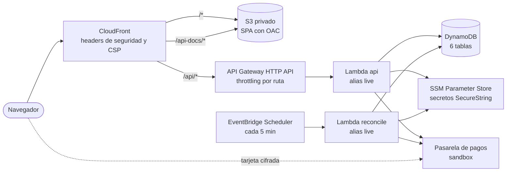

# Tech Store — Infraestructura (AWS + Terraform)

| Repositorio                                                                         | Contenido                                                         |
| ----------------------------------------------------------------------------------- | ----------------------------------------------------------------- |
| [tech-store-checkout-web](https://github.com/IamStivgo/tech-store-checkout-web)     | Frontend: SPA React                                               |
| [tech-store-checkout-api](https://github.com/IamStivgo/tech-store-checkout-api)     | Backend: API NestJS, Swagger y modelo de datos                    |
| [tech-store-checkout-infra](https://github.com/IamStivgo/tech-store-checkout-infra) | Infraestructura: Terraform y despliegue en AWS (este repositorio) |

Infraestructura serverless en AWS, definida con Terraform, para la tienda de accesorios tecnológicos: CloudFront y S3 para la SPA, API Gateway y Lambda para el API, DynamoDB, SSM Parameter Store y EventBridge Scheduler. Este repositorio crea toda la infraestructura; los repositorios web y api solo despliegan su código.

**App:** https://d7vch0fsx8645.cloudfront.net · **Swagger:** https://d7vch0fsx8645.cloudfront.net/api-docs/index.html

## Arquitectura en AWS

Un solo dominio de CloudFront sirve la SPA, el API y la documentación, así que el navegador nunca hace peticiones entre orígenes a nuestro backend.



| Recurso | Módulo | Detalle |
| --- | --- | --- |
| CloudFront + S3 | `static-site` | S3 privado con Origin Access Control, función de enrutamiento de la SPA, CSP, HSTS, `X-Frame-Options`, `nosniff`, `Referrer-Policy`, `Permissions-Policy`, `Cross-Origin-Opener-Policy` y `Cross-Origin-Resource-Policy`; header secreto `x-origin-verify` hacia el API |
| API Gateway HTTP API | `api` | Proxy `ANY /api/{proxy+}` y rutas sensibles con throttling propio (crear transacción, pagar, webhook) |
| Lambdas `api` y `reconcile` | `api` | Node.js 24 en arm64, alias `live` para despliegues y rollback, logs con retención de 14 días |
| DynamoDB | `database` | 6 tablas on-demand con PITR, protección contra borrado, índices de referencia y de pendientes, TTL de idempotencia |
| SSM Parameter Store | `secrets` | Solo nombres y ARN de los secretos de la pasarela (los valores se crean con la CLI) |
| EventBridge Scheduler | `scheduler` | Invoca la conciliación cada 5 minutos |
| Roles OIDC | `ci-roles`, `bootstrap` | Un rol por pipeline con permisos mínimos y confianza solo desde el environment `production` de su repositorio |

## Seguridad

- **Sin llaves estáticas:** los pipelines asumen roles con OIDC de GitHub y solo desde el environment `production`, que exige aprobación.
- **Mínimo privilegio:** cada Lambda solo accede a sus tablas, índices y parámetros; el rol de `plan` de los PR no puede leer los secretos.
- **Secretos fuera del estado:** los valores de la pasarela viven en SSM (SecureString) y la URL y la llave pública llegan desde secrets del repositorio como variables `sensitive`, así que nunca se versionan ni aparecen en el plan publicado.
- **Borde:** HTTPS obligatorio, headers de seguridad y CSP en CloudFront, bucket privado y throttling en API Gateway. Calificación **A+** en [MDN HTTP Observatory](https://developer.mozilla.org/en-US/observatory).
- **Solo a través de CloudFront:** CloudFront agrega a cada petición al API el header `x-origin-verify` con un secreto compartido que la Lambda también recibe; el API responde 403 a quien llame a API Gateway directamente y se salte los headers y protecciones del borde.

## Costos

| Servicio | Costo esperado |
| --- | --- |
| Lambda, API Gateway, DynamoDB on-demand, CloudFront, S3 | Dentro de la capa gratuita con el tráfico de la prueba |
| SSM Parameter Store (parámetros estándar) | Sin costo |
| **Total estimado** | **≈ USD 0–1 al mes** |

La cuenta tiene presupuestos con alertas por correo para detectar cualquier gasto inesperado.

## Estructura

```
bootstrap/          # Se aplica una vez: bucket del estado de Terraform, proveedor OIDC de GitHub y rol de Terraform
modules/
├── static-site/    # S3 + CloudFront para la SPA
├── api/            # Lambdas, API Gateway HTTP API, logs e IAM
├── database/       # Tablas DynamoDB
├── secrets/        # Parámetros SSM de la pasarela de pagos
├── scheduler/      # EventBridge Scheduler para la conciliación
└── ci-roles/       # Roles OIDC de despliegue para los repos web y api
envs/
└── prod/           # Composición de los módulos del entorno de producción
placeholder/        # Handler mínimo con el que se crean las Lambdas
```

## Requisitos

| Herramienta | Versión                                    |
| ----------- | ------------------------------------------ |
| Terraform   | ≥ 1.11                                     |
| TFLint      | Con el ruleset de AWS (`tflint --init`)    |
| Node.js     | 24 (`nvm use`), solo para los hooks de git |

## Uso local

```bash
npm ci                                            # Instala los hooks de git
tflint --init                                     # Descarga el ruleset de AWS
terraform -chdir=envs/prod init -backend=false    # Proveedores, sin conectar el estado remoto
terraform -chdir=envs/prod validate
```

Para trabajar contra el estado real (con un perfil de AWS con permisos sobre `checkout-app-*`):

```bash
terraform -chdir=envs/prod init -backend-config="bucket=checkout-app-tfstate-<account_id>"
terraform -chdir=envs/prod plan
```

| Script           | Descripción                                                                                               |
| ---------------- | --------------------------------------------------------------------------------------------------------- |
| `npm run lint`   | `terraform fmt -check` y `tflint` en todo el repositorio                                                  |
| `npm run format` | Aplica `terraform fmt` en todo el repositorio                                                             |
| `npm test`       | `terraform test` del bootstrap y de cada módulo con pruebas (proveedor simulado, sin credenciales de AWS) |

## Bootstrap (una sola vez)

`bootstrap/` crea lo que Terraform y GitHub Actions necesitan antes que todo lo demás:

- Bucket `checkout-app-tfstate-<account_id>` para el estado: versionado, cifrado, privado y solo accesible con TLS 1.2 o superior.
- Proveedor OIDC de GitHub Actions.
- Rol `checkout-app-terraform-plan`: solo lectura, para los PR de este repositorio. No puede leer los secretos de la pasarela.
- Rol `checkout-app-terraform-apply`: solo para el environment `production`. No puede modificar los recursos del bootstrap.

El backend es **parcial**: el nombre del bucket no se versiona y se pasa con `-backend-config`. El primer `apply` se hace con estado local, que luego se migra al bucket:

```bash
export AWS_PROFILE=<perfil con permisos sobre checkout-app-*>
mv bootstrap/backend.tf bootstrap/backend.tf.off     # 1. Primer apply con estado local
terraform -chdir=bootstrap init
terraform -chdir=bootstrap apply
STATE_BUCKET=$(terraform -chdir=bootstrap output -raw state_bucket_name)
mv bootstrap/backend.tf.off bootstrap/backend.tf     # 2. Migra el estado al bucket creado
terraform -chdir=bootstrap init -migrate-state -backend-config="bucket=$STATE_BUCKET"
rm bootstrap/terraform.tfstate bootstrap/terraform.tfstate.backup
```

Después, en cualquier máquina:

```bash
terraform -chdir=bootstrap init -backend-config="bucket=checkout-app-tfstate-<account_id>"
```

## Secretos de la pasarela de pagos

La llave privada, el secreto de integridad y el secreto de eventos del sandbox se guardan como parámetros `SecureString` en SSM y **no los gestiona Terraform**. Si los gestionara, al refrescar leería el valor descifrado: el secreto quedaría en el estado y el rol de `plan` de los PR, que tiene denegada su lectura, fallaría. El módulo `secrets` solo expone sus nombres (`terraform output payment_parameter_names`) y sus ARN para las políticas de las Lambdas.

Se crean o rotan una vez con la CLI, sin que el valor quede en el historial de la terminal:

```bash
for secret in private-key integrity-secret events-secret; do
  read -rsp "Valor de ${secret}: " value && echo
  aws ssm put-parameter --name "/checkout-app/prod/payment/${secret}" \
    --type SecureString --value "$value" --overwrite >/dev/null
done
unset value
```

## Flujo de trabajo

- Ramas: `main` (estable), `develop` (integración) y `feature/HU-xxx-descripcion`.
- Commits en inglés con [Conventional Commits](https://www.conventionalcommits.org/) más el tipo `infra`, validados por commitlint.
- Antes de cada commit, lint-staged ejecuta `terraform fmt` y `tflint` sobre los archivos `.tf` modificados.
- Integración continua con GitHub Actions en cada PR y push a `develop` y `main`: `terraform fmt -check`, `tflint`, `terraform validate` de `bootstrap` y `envs/prod` y las pruebas del bootstrap y de los módulos. Dependabot propone actualizaciones semanales del proveedor de AWS y de las acciones.

## Despliegue (GitHub Actions con OIDC, sin llaves de AWS)

| Workflow                       | Cuándo                                                  | Rol                                          | Qué hace                                                                                                                                                                 |
| ------------------------------ | ------------------------------------------------------- | -------------------------------------------- | ------------------------------------------------------------------------------------------------------------------------------------------------------------------------ |
| `ci.yml`, job `Terraform plan` | Cada PR del propio repositorio (no forks ni Dependabot) | `checkout-app-terraform-plan` (solo lectura) | `terraform plan` de `envs/prod` contra el estado real y comentario en el PR con el resumen y el plan completo                                                            |
| `apply.yml`                    | Merge a `main` (o manual)                               | `checkout-app-terraform-apply`               | Tras la aprobación del environment `production`: `plan` + `apply` de `envs/prod`, verificación de los parámetros `/checkout-app/prod/deploy/*` y resumen con los outputs |

El repositorio es público: el ID de la cuenta se enmascara en los logs y se reemplaza por `<account-id>` en los comentarios y resúmenes. Configuración del repositorio: variable `AWS_REGION` y **secrets** `TF_STATE_BUCKET`, `AWS_TERRAFORM_PLAN_ROLE_ARN` y `AWS_TERRAFORM_APPLY_ROLE_ARN` (salidas del bootstrap). Son secrets porque contienen el ID de la cuenta: GitHub imprime los parámetros de las acciones antes de que se active el enmascarado, y solo los secrets quedan ocultos desde el inicio.

`apply.yml` además pasa como variables `sensitive` (`TF_VAR_*`) los secrets `PAYMENT_API_BASE_URL` y `PAYMENT_PUBLIC_KEY` (URL y llave pública del sandbox, para la Lambda y la CSP) y `ORIGIN_VERIFY_SECRET` (el secreto entre CloudFront y el API, de al menos 32 caracteres).

## Decisiones y limitaciones

- **Serverless y un solo dominio:** costo casi nulo, sin servidores que mantener y sin CORS entre la SPA y el API.
- **Terraform crea, las aplicaciones despliegan:** las Lambdas se crean con un handler mínimo y los repos web y api despliegan su código con sus propios roles; los nombres de los recursos se publican en `/checkout-app/prod/deploy/*`.
- **Sin dominio propio:** se usa el dominio de CloudFront; un dominio con certificado de ACM queda como mejora futura.
- **Pendiente:** alarmas de CloudWatch con aviso por correo (requieren ampliar la política del operador).

## Autor

Stiven · [@IamStivgo](https://github.com/IamStivgo)
